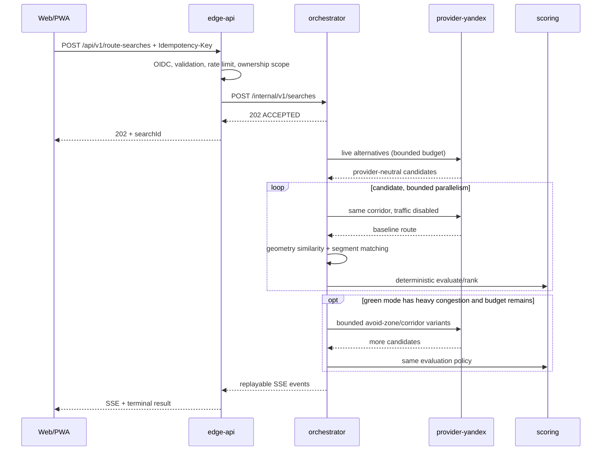

# Архитектура Пробок.Нет

## Контекст и границы

Пробок.Нет разделён по независимым причинам изменения, а не по техническим слоям.

| Компонент | Публичная ответственность | Собственные данные | Не имеет права делать |
|---|---|---|---|
| `apps/web` | карта, ввод, сравнение, SSE/PWA, RU/EN | только browser session | получать server provider key, объявлять UNKNOWN свободным |
| `edge-api` | public REST, OIDC, authorization, limits, idempotency, ownership, SSE proxy | audit без координат; Redis security state | ранжировать маршруты или видеть raw provider payload |
| `routing-orchestrator` | search lifecycle, budget, baseline, detours, selection | короткоживущий normalized state | знать provider DTO/keys, менять hard constraints |
| `provider-yandex` (historical name) | официальный Yandex или 2GIS Router/Geocoder, retry/CB/bulkhead/rate gate, normalization, billing units | circuit state и агрегированные counters | сохранять raw payload или отдавать key наружу |
| `internal/scoring` | чистая детерминированная оценка и ranking | versioned config, без state | обращаться к сети или БД |

Версионированный provider-neutral JSON/HTTP выбран для внутренней границы первой версии. Контракт мал, synchronous и покрыт schema/contract tests; сервисы остаются независимо deployable. Переход на ConnectRPC возможен без изменения domain/frontend, если profiling покажет пользу binary transport. Решение и trade-off зафиксированы в ADR-001/002.

## Последовательность поиска

## Поиск зелёного коридора

`services/routing-orchestrator/greensearch.go` превращает «дай альтернативы» в направленный
поиск. Провайдер не умеет принимать требование «меньше пробок», поэтому требование
переводится в геометрию: запретные зоны и промежуточные точки.

1. **Кластеризация.** Точки маршрута с классом хуже зелёного склеиваются в кластеры. Радиус
   ограничен `180…2500 м`, кластеры ближе `420 м` сливаются. Кластер описывается октагоном —
   `exclude`-полигоном провайдера.
2. **Защита концов.** Кластер, оказавшийся ближе `700 м` к origin или destination,
   отбрасывается, а радиус остальных ужимается до фактического зазора. Без этого полигон
   накрывает саму точку старта, и провайдер молча переносит её — маршрут получается не тот,
   который просили. Кандидат, у которого конец уехал дальше `400 м`, отбраковывается с
   `DETOUR_ENDPOINTS_RELOCATED_BY_PROVIDER`.
3. **Лестница гипотез.** От дешёвых к агрессивным: запрет красных зон → запрет красных и
   оранжевых → боковой якорь перпендикулярно направлению движения (`400 м…12 км`, масштаб от
   разрешённого объезда) → якорь вместе с запретом возврата в пробку → обход двух кластеров
   сразу → запрет всего незелёного. Замыкает лестницу хвост послаблений: полный набор
   запретов часто нероутится, когда пробка стоит на единственном мосту.
4. **Бюджет.** Каждая гипотеза — один запрос к провайдеру; бюджет задаётся режимом. Два
   подряд отказа провайдера прекращают поиск (`DETOUR_SEARCH_STOPPED_EARLY`), чтобы не жечь
   дневную квоту на заведомо безнадёжные варианты.
5. **Ранжирование.** Найденные кандидаты дедуплицируются по геометрии и сортируются по доле
   времени по зелёному; первые три получают `GREEN_RANK_1..3` и уезжают в `greenTopRoutes`.
   Это же и есть доказательство для пользователя, что поиск был, а не один вызов API.

## Инварианты домена

1. Hard constraints исполняются до ranking. Маршрут за лимитом не может победить независимо от score.
2. `STRICT_GREEN` использует лексикографический порядок, а не непрозрачную сумму.
3. Baseline сравнивается только после geometry matching. Ниже порога сегмент становится `UNKNOWN`.
4. `UNKNOWN != GREEN`; неизвестная доля понижает confidence и может исключить route.
5. Request budget резервируется до provider call и не может быть oversubscribed конкурентными baseline tasks.
6. Network request count и provider billable response units — разные величины.
7. Raw provider payload не пересекает адаптер и не попадает в logs/storage.

## Состояние и согласованность

- `edge-api` хранит в Redis только idempotency body hash/search ID, owner subject и rate counters. Replay читает актуальный result из orchestrator, поэтому provider geometry не дублируется в idempotency storage.
- PostgreSQL audit содержит UUID, HMAC subject, mode, округлённый лимит и бюджет — без origin/destination/geometry.
- Orchestrator по умолчанию хранит normalized route state в памяти. Redis state разрешается лишь при `PROVIDER_DATA_STORAGE_ALLOWED=true` и коротком TTL. Поэтому fail-closed production values не масштабируют orchestrator выше одной реплики до license approval.
- SSE имеет монотонный `eventId`; `Last-Event-ID` воспроизводит пропущенные события. Polling GET остаётся fallback.

## Failure model

Provider timeout/429/5xx проходит через bounded retry с jitter, shared concurrency bulkhead и circuit breaker. Orchestrator учитывает фактически использованный budget. При невозможности enhanced search возвращается лучшая честно оценённая исходная альтернатива с warning; при невозможности получить/оценить исходные кандидаты статус `DEGRADED` не маскируется под success.

Edge ошибки нормализует в RFC 9457-style problem JSON и не ретранслирует upstream URL/body. Readiness проверяет required dependencies; liveness не зависит от сети. Все процессы поддерживают graceful shutdown.

## Наблюдаемость

Trace context проходит через edge, orchestrator и provider; spans создаются HTTP instrumentation и domain stages. Метрики не имеют coordinate/search ID labels. Prometheus rules используют SLO 99.9%, initial p95 <3s, enhanced p95 <10s, 5xx <0.1%; пять Grafana dashboards разделяют product, provider/cost, quality, API и degraded/low-confidence views.

## Deployment

Containers собираются multi-stage, запускаются non-root в distroless/scratch, root filesystem read-only, capabilities dropped. Helm применяет PSS restricted, topology spread, PDB, HPA, default-deny NetworkPolicy и explicit egress. Secrets поступают только через existing Secret/External Secrets workflow.
