<div align="center">


# Пробок.Нет

**Маршрут не самый быстрый, а самый зелёный.**

Навигаторы отвечают на вопрос «как доехать быстрее». Пробок.Нет отвечает на другой:
**«как доехать, почти не стоя в пробке»** — даже если ради этого придётся сделать крюк.

### [→ Открыть демо](https://beztebya666.github.io/Probok.Net/)

<sub>Открывается сразу на разобранном примере: маршрут, топ-3, избранное и закладки уже заполнены.
Всё кликается, боевых запросов не делает, ключей не содержит.</sub>

</div>

<p align="center">
  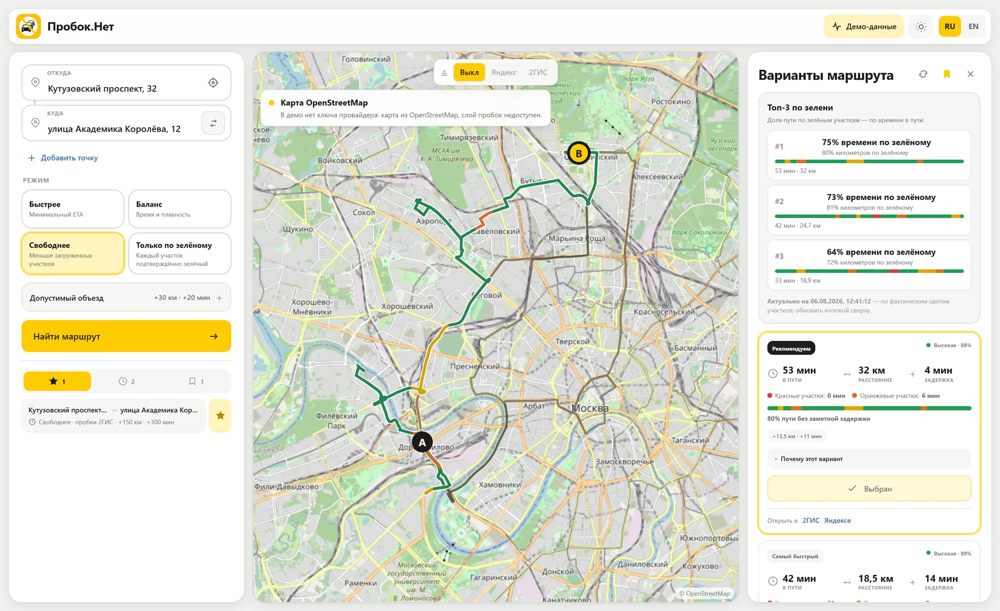
</p>

---

## Что показывает демо

Замороженный настоящий ответ провайдера: проспект Вернадского, 78 → Ленинградское шоссе, 39,
снято 2026-08-06 22:21 UTC. Лучший вариант — **97% времени по зелёному**, 34 мин, 38.7 км;
рядом лежат ещё два и маршрут для сравнения.

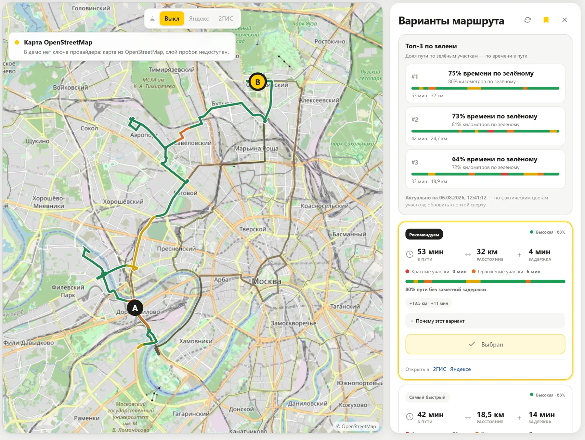

Ночью в городе нет заторов, поэтому этот срез показывает механику, а не драму: чтобы в примере
был виден объезд стоящего участка, снимок надо снять в час пик — это одна команда
(`node tools/docs-media/freeze-live-search.mjs "<откуда>" "<куда>"`), и демо пересоберётся на нём.

## Зачем это

Обычный навигатор оптимизирует ETA. Он с удовольствием отправит вас в плотный поток на
магистрали, если это даёт выигрыш в две минуты. Стоять в пробке при этом придётся 40 минут
из 50.

Пробок.Нет считает другую величину — **долю пути по свободным участкам** — и целенаправленно
ищет объезд, который эту долю увеличивает. Приехать на 15 минут позже, но ехать всю дорогу
40 км/ч вместо «5 минут ползком, рывок, снова ползком», — это и есть цель.

Ключевое отличие от «попросить у провайдера альтернативы»: приложение **само ведёт поиск**.
Оно находит пробки на маршруте, запрещает их провайдеру и просит проложить маршрут заново —
и так по лестнице всё более агрессивных гипотез, пока не кончится бюджет запросов.

## Killer-фичи

| | |
|---|---|
| **Топ-3 по зелени** | Не «вот маршрут, поверьте». Три найденных варианта, отсортированные по доле зелени, с полосой фактических цветов участков. Видно, что поиск действительно был. |
| **Объезд до +150 км / +300 мин** | Дворы, встречка по правилам, крюк через соседний район — допустимо, если это убирает красное. Лимиты ваши, а не зашиты в код. |
| **Закладки без расхода квоты** | Сохранённый анализ открывается мгновенно и не тратит ни одного запроса к API. Кнопка обновления рядом — и если провайдер недоступен или лимит исчерпан, старые данные **не стираются**. |
| **Ссылки 1:1 в 2ГИС и Яндекс** | Найденный объезд открывается во внешнем навигаторе тем же маршрутом — через промежуточные точки, а не «примерно туда же». |
| **Честность про данные** | Участок без данных о пробках — это `UNKNOWN`, а не «свободно». Оценка уверенности видна в карточке. |
| **Тёмная тема и мобилка** | Тема запоминается, карта переключает стиль вместе с ней, на телефоне кнопка поиска помещается на первый экран. |

<table>
<tr>
<td width="50%">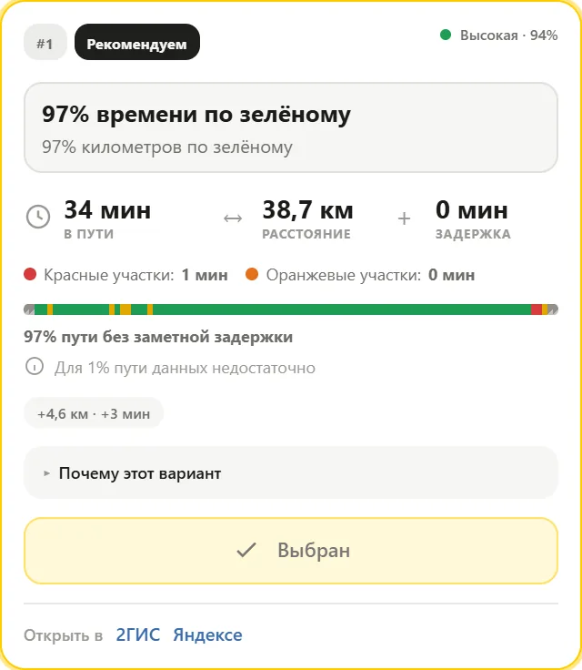</td>
<td width="50%">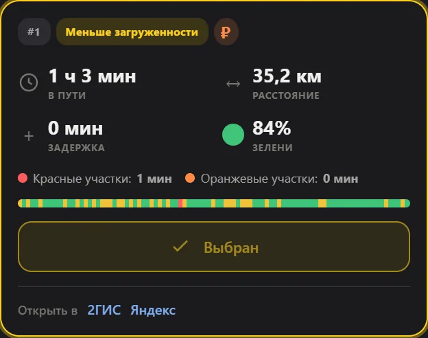</td>
</tr>
</table>

## Как это работает

### 1. Цвета участков — от провайдера, не выдуманные

Маршрут запрашивается у 2GIS Routing API 7.0.0 с покусочной раскраской. Классы провайдера
переводятся в наши напрямую:

| 2GIS | Пробок.Нет | Смысл |
|---|---|---|
| `fast`, `free` | 🟢 `GREEN` | свободно |
| `normal` | 🟡 `YELLOW` | плотно, но едем |
| `fluid` | 🟠 `ORANGE` | вязко |
| `slow`, `slow-jams` | 🔴 `RED` | пробка |
| `ignore`, нет данных | ⬜ `UNKNOWN` | **не** считается зелёным |

### 2. Поиск зелёного коридора

Это не один запрос к провайдеру, а цикл (`services/routing-orchestrator/greensearch.go`):

```text
маршрут-кандидат
      │
      ▼
① кластеризация пробок   точки RED/ORANGE/YELLOW склеиваются в кластеры
   радиус 180…2500 м     ближе 420 м — сливаются в один
      │
      ▼
② защита концов          кластер ближе 700 м к точке А или Б отбрасывается:
                         иначе провайдер «переставит» саму точку старта
      │
      ▼
③ лестница гипотез       AVOID_ALL_RED_n        запретить все красные зоны
   (по нарастающей)      AVOID_RED_AND_ORANGE_n добавить оранжевые
                         LATERAL_LEFT/RIGHT_xM  якорь сбоку от худшей пробки
                         GUARDED_LATERAL_…      якорь + запрет возврата в пробку
                         MULTI_CLUSTER_BYPASS   обход двух кластеров сразу
                         AVOID_EVERY_NON_GREEN  запретить даже жёлтый хвост
                         + хвост послаблений    если полный запрет нероутится
      │
      ▼
④ новый запрос           каждая гипотеза — один запрос к провайдеру
      │
      ▼
⑤ проверка              endpoints не уехали дальше 400 м?
                        геометрия не дубль уже найденного?
                        уложились в лимит км/минут?
      │
      ▼
⑥ ранжирование          сортировка по доле времени по зелёному → GREEN_RANK_1..3
```

Боковой якорь ставится **перпендикулярно направлению движения** — на 400 м…12 км в сторону,
масштабируясь от разрешённого объезда. Отсюда и берутся «дворами и параллельными улицами».

Бюджет запросов ограничен режимом (`FASTEST` — 2, `BALANCED` — 4, зелёные режимы — 8), а два
подряд отказа провайдера прекращают поиск досрочно: дневная квота 2GIS — 50 объектов, и
сжигать её на заведомо нероутируемые гипотезы нельзя.

### 3. Режимы

| Режим | strictness | Допуск по расстоянию | Бюджет запросов |
|---|---|---|---|
| Быстрее (`FASTEST`) | 0 | +100 % | 2 |
| Баланс (`BALANCED`) | 0.5 | +100 % | 4 |
| Свободнее (`GREENEST`) | 0.82 | +300 % | 8 |
| Только по зелёному (`STRICT_GREEN`) | 1 | +300 % | 8 |

`STRICT_GREEN` — fail-closed: если ни один найденный вариант не подтверждён зелёным целиком,
приложение **не подставляет** обычный быстрый маршрут вместо него ([ADR-014](docs/adr/ADR-014-strict-green-fail-closed.md)).

## Как выглядит

### Поиск от адреса до трёх вариантов

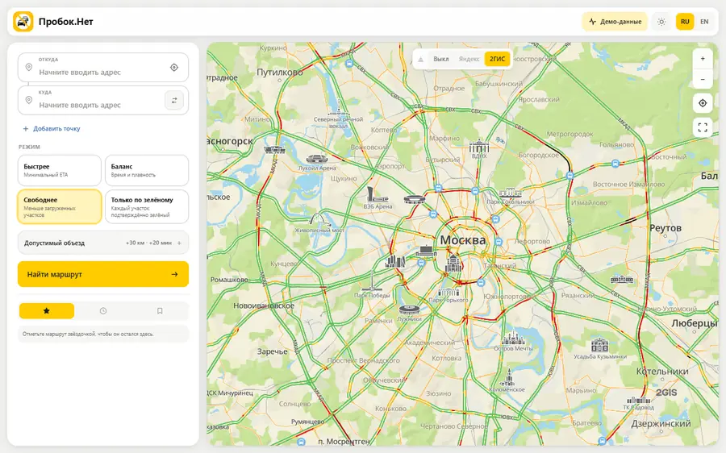

### Клик по варианту показывает его на карте

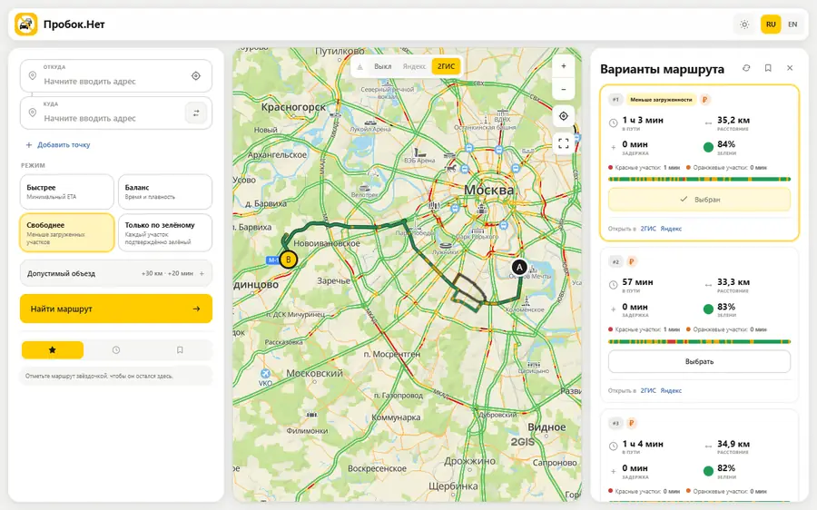

### Тёмная тема

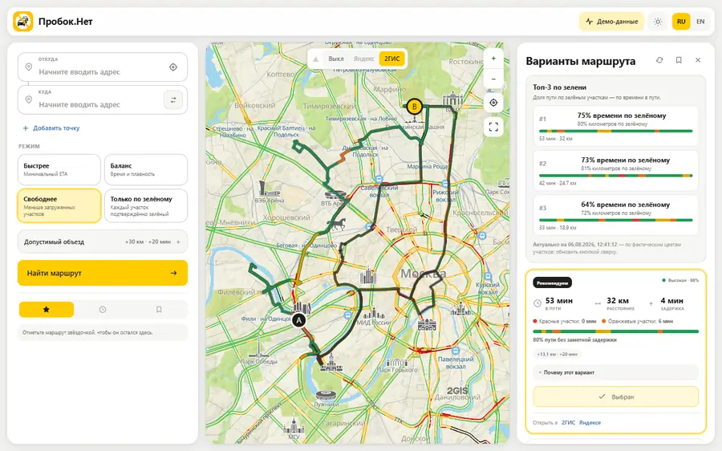

### Закладки: сохранить и вернуться без запросов к API

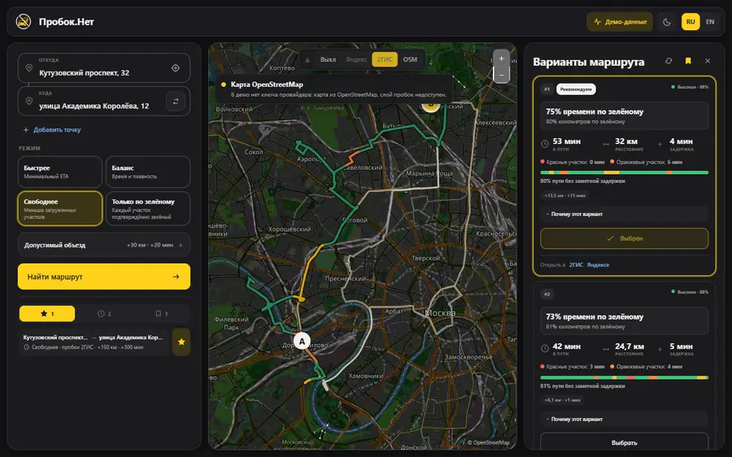

### Десктоп, планшет, телефон

<table>
<tr>
<td width="50%">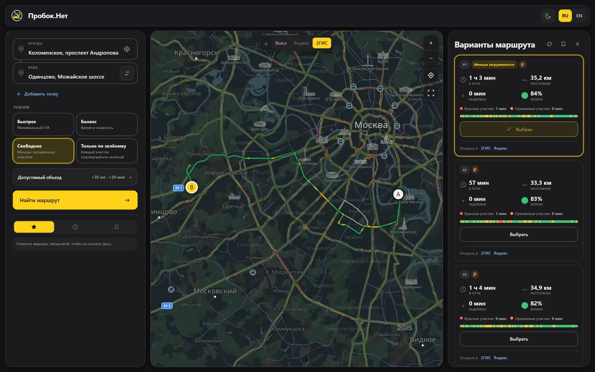</td>
<td width="50%">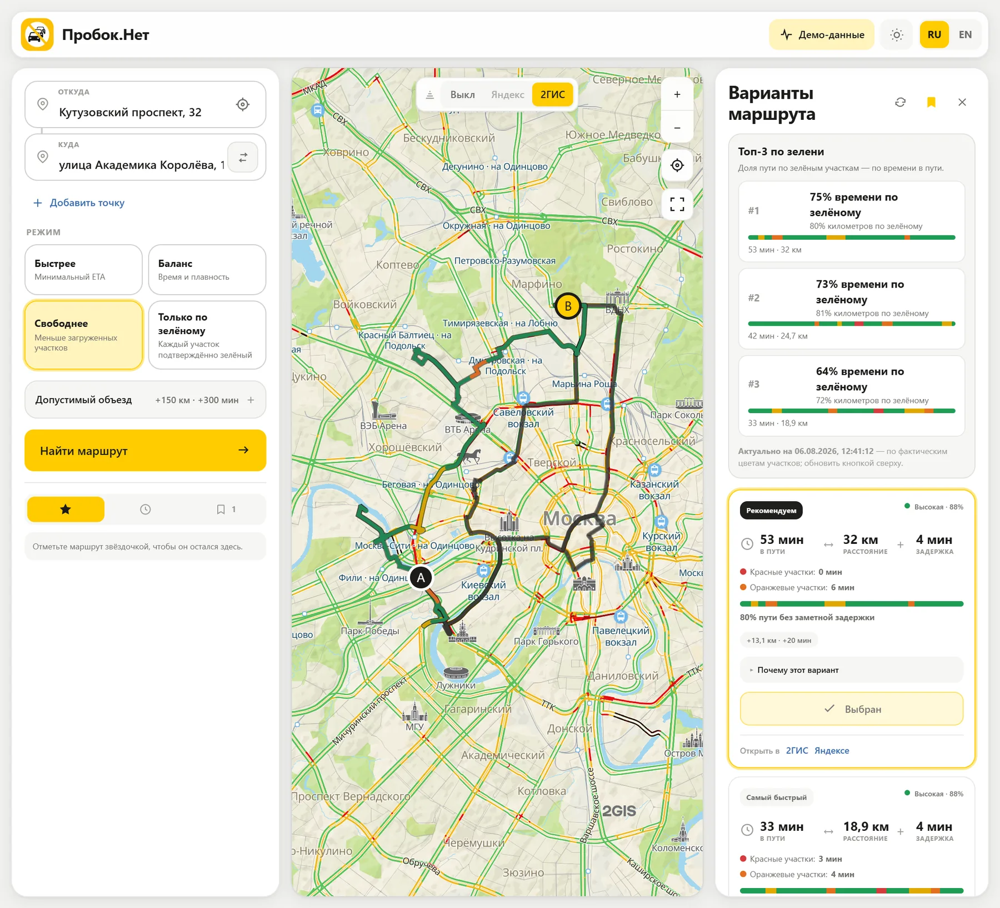</td>
</tr>
</table>

<table>
<tr>
<td width="33%">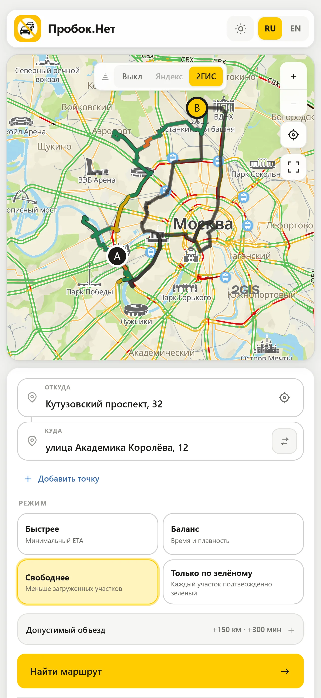</td>
<td width="33%">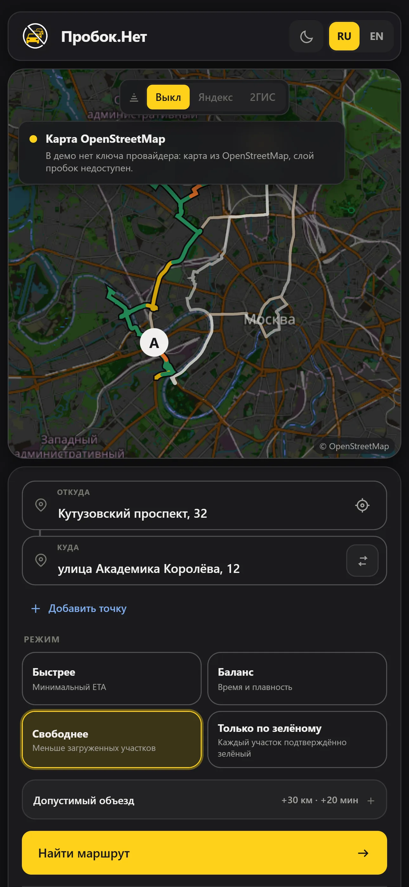</td>
<td width="33%">
<br>

</td>
</tr>
</table>

> Скриншоты и клипы сняты в демо-режиме (в шапке видна плашка «Демо-данные»): геометрия дорог и
> карта настоящие, цвета участков — фиксированный синтетический набор. Демо ходит по картам
> OpenStreetMap: ключа провайдера в публичной статике нет, поэтому слой пробок там недоступен.
> Так документацию можно пересобрать в любой момент, не тратя дневную квоту Routing API.
> Пересборка: `tools/docs-media/` — [build-demo-analysis.mjs](tools/docs-media/build-demo-analysis.mjs),
> [shoot.mjs](tools/docs-media/shoot.mjs), [record.mjs](tools/docs-media/record.mjs),
> [build-clips.py](tools/docs-media/build-clips.py), [optimise-images.py](tools/docs-media/optimise-images.py).

---

# Техническая часть

## Архитектура

```text
browser / PWA
    │ REST + SSE (OIDC)
    ▼
edge-api :8080 ───────────────► provider-yandex :8082 ──► официальные API провайдеров
    │                                   ▲
    │ internal versioned JSON/HTTP      │ по умолчанию только официальные API
    ▼                                   │
routing-orchestrator :8081 ─────────────┘
    │       ├── greensearch.go   лестница гипотез объезда
    │       └── internal/scoring + internal/geometry
    ├── transient search state (в памяти; Redis только после юридического подтверждения)
    └── OTel / Prometheus

edge-api ──► Redis (rate limit, idempotency, ownership)
         └─► PostgreSQL (аудит без координат и геометрии провайдера)
```

Подробности: [ARCHITECTURE.md](ARCHITECTURE.md), [OpenAPI](docs/api/openapi.yaml),
[матрица провайдеров](PROVIDER_CAPABILITIES.md).

## Что реализовано

- четыре режима поиска с раздельными лимитами и бюджетом запросов;
- собственный поиск зелёного коридора: кластеризация пробок, зоны запрета, боковые якоря,
  защита концов маршрута, дедупликация геометрии, ранжирование `GREEN_RANK_1..3`;
- provider-neutral adapter: 2GIS Routing/Geocoder, Yandex Router/Geocoder или полностью
  детерминированный synthetic provider для запуска без ключей;
- baseline-сопоставление, geometry confidence, hard constraints и versioned scoring;
- асинхронный API, replayable SSE, отмена, idempotency и ownership checks;
- OIDC/OAuth 2.1 bearer validation, user/IP rate limits, CORS allowlist, internal service token;
- Next.js 16 PWA: RU/EN, тёмная тема, 2GIS MapGL и Yandex JS API v3, закладки, избранное,
  история, глубокие ссылки во внешние навигаторы;
- PostgreSQL privacy-minimized audit, Redis idempotency/rate limiting;
- OpenTelemetry, Prometheus, Grafana dashboards, alerts, SLO;
- Docker Compose, Helm/Kubernetes, CI/CD, k6, Playwright.

## Быстрый локальный запуск

Требуется Docker 29+ с Compose v2. Локальный профиль использует synthetic provider и ключей
не требует.

```powershell
Copy-Item .env.example .env
docker compose up --build --wait
```

Откройте <http://localhost:3000>. Проверки:

```powershell
Invoke-RestMethod http://localhost:8080/health/ready
Invoke-RestMethod http://localhost:8081/health/ready
Invoke-RestMethod http://localhost:8082/health/ready
```

Остановка без удаления данных — `docker compose stop`. Удаление volumes (`docker compose down
--volumes`) необратимо.

Запуск без Docker, из собранных бинарников: `tools/start-local.ps1` (сервисы) и
`tools/start-web-local.ps1` (веб). Второй скрипт слушает `0.0.0.0`, чтобы приложение
открывалось с телефона в той же сети; для провайдеров с проверкой Referer используйте имя
вида `192-168-1-22.nip.io` вместо голого IP.

## 2GIS

```dotenv
PROVIDER_MODE=2gis
ADDRESS_PROVIDER_MODE=auto
DGIS_API_KEY=replace-locally
DGIS_RATE_LIMIT_PER_MINUTE=12
DGIS_MONTHLY_LIMIT=1000
DGIS_GEOCODER_RATE_LIMIT_PER_MINUTE=600
DGIS_GEOCODER_LOCATION_BIAS=37.617635,55.755814
NEXT_PUBLIC_2GIS_MAPGL_API_KEY=browser-restricted-key
```

Маршруты — Routing API 7.0.0. Адреса — Yandex HTTP Geocoder, если задан
`YANDEX_GEOCODER_API_KEY`, иначе 2GIS Geocoder API 3.0; `ADDRESS_PROVIDER_MODE=yandex|2gis`
делает выбор явным. Значение `location` у 2GIS — подсказка ранжирования, а не фильтр, поэтому
явно названные города продолжают работать.

Минутный гейт должен быть **не меньше бюджета одного поиска** (зелёные режимы — до 8 запросов),
иначе поиск упрётся в собственный лимит и вернёт 503. Секреты в браузер не передаются: ключ
MapGL — отдельный, ограниченный по origin.

## Yandex

```dotenv
PROVIDER_MODE=yandex
YANDEX_ROUTER_API_KEY=replace-locally
YANDEX_GEOCODER_API_KEY=replace-locally
NEXT_PUBLIC_YANDEX_MAPS_API_KEY=browser-restricted-key
GREENROUTE_YANDEX_TRAFFIC_AVAILABLE=false
```

Серверные ключи никогда не имеют префикса `NEXT_PUBLIC_`. Слой пробок Яндекса доступен только
на платном тарифе — по умолчанию он отключён и помечен в интерфейсе как платный, а не
«сломанный». Условия тарифа, география и хранение проверяются по договору до production:
[PROVIDER_CAPABILITIES.md](PROVIDER_CAPABILITIES.md).

## Операционная консоль

Страница `/admin` показывает, какой модуль какого провайдера используется, зачем и с каким
лимитом тарифа. Она выключена по умолчанию и включается двумя независимыми флагами:

```dotenv
GREENROUTE_ADMIN_ENABLED=false   # доступность /admin; иначе 404
GREENROUTE_ADMIN_IN_MENU=false   # ссылка в шапке; работает только вместе с первым
```

## API

Примеры: [docs/api/examples.md](docs/api/examples.md). Минимальный поиск:

```bash
curl http://localhost:8080/api/v1/route-searches \
  -H 'Content-Type: application/json' \
  -H 'Idempotency-Key: readme-example-001' \
  --data '{"origin":{"latitude":55.751244,"longitude":37.618423},"destination":{"latitude":55.8319,"longitude":37.4116},"routingMode":"GREENEST","maxExtraDistanceMeters":30000,"maxExtraTimeSeconds":1200,"maxProviderRequests":8,"searchDeadlineMs":10000}'
```

Ответ содержит `greenTopRoutes` — до трёх кандидатов, отсортированных по доле времени по
зелёному, каждый с `GREEN_RANK_n` в `reasonCodes`.

## Проверка и сборка

```powershell
go test ./...
go vet ./...
Push-Location apps/web
npm ci
npm run lint
npm run typecheck
npm test
npm run build
Pop-Location
npx --yes @redocly/cli@2.44.2 lint docs/api/openapi.yaml --extends=minimal
docker compose config --quiet
helm lint deploy/helm/greenroute -f deploy/helm/greenroute/values-dev.yaml
```

End-to-end (Playwright). По умолчанию поднимает собственный dev-сервер в демо-режиме:

```powershell
Push-Location apps/web
npm run test:e2e
Pop-Location
```

Next не разрешает второй dev-сервер в том же каталоге, поэтому если сервер разработки уже
запущен — соберите демо-сборку и укажите её адрес:

```powershell
$env:PLAYWRIGHT_DEMO_BASE_URL = "http://127.0.0.1:3100"   # весь набор, демо-фикстуры
$env:PLAYWRIGHT_BASE_URL      = "https://staging.example"  # только full-stack и security
```

Сквозной Windows smoke-test:

```powershell
New-Item -ItemType Directory -Force bin | Out-Null
go build -o bin/provider-yandex.exe ./services/provider-yandex
go build -o bin/routing-orchestrator.exe ./services/routing-orchestrator
go build -o bin/edge-api.exe ./services/edge-api
powershell -ExecutionPolicy Bypass -File tests/integration/smoke-local.ps1
```

## Развёртывание

```bash
helm dependency build deploy/helm/greenroute
helm upgrade --install greenroute deploy/helm/greenroute \
  --namespace greenroute --create-namespace \
  -f deploy/helm/greenroute/values-prod.yaml \
  --set-string secrets.existingSecret=greenroute-runtime
```

Сначала создайте external secret с OIDC, internal token и ключами провайдеров. Секреты не
передаются через Helm values в Git. Rollback и DR: [docs/runbooks](docs/runbooks).

## Безопасность и приватность

- Production не стартует с анонимным доступом, без OIDC, Redis, PostgreSQL, audit hash key
  или с коротким internal token.
- Ответы провайдеров и точные координаты не логируются.
- Кэширование и хранение данных провайдера выключены; Redis route state включается только
  вместе с `PROVIDER_DATA_STORAGE_ALLOWED=true` после юридического подтверждения.
- Без разрешённого distributed route state orchestrator намеренно работает в одной реплике;
  edge и provider масштабируются независимо.
- Закладки, избранное, история, тема и лимиты живут в `localStorage` браузера и на сервер не
  уходят.

Политики: [SECURITY.md](SECURITY.md), [PRIVACY.md](PRIVACY.md),
[THREAT_MODEL.md](THREAT_MODEL.md), [license checklist](LICENSE_COMPLIANCE_CHECKLIST.md).

## Демо на GitHub Pages

[beztebya666.github.io/Probok.Net](https://beztebya666.github.io/Probok.Net/) — статический
экспорт приложения в демо-режиме. Поиск отвечает из фикстур прямо в браузере, поэтому сайт не
обращается ни к одному провайдеру и не содержит ключей; при нажатии «Найти маршрут» это прямо
сказано тостом. Карта там схематичная — без ключа MapGL показывать чужие тайлы нечем.

Собрать локально:

```powershell
$env:NEXT_PUBLIC_BASE_PATH = "/Probok.Net"
node tools/pages/build-static-demo.mjs
```

Сборка временно убирает из дерева то, что несовместимо со статическим экспортом (proxy,
`/api/health`, `/admin`) и возвращает на место даже при ошибке. Публикацией занимается
[.github/workflows/pages.yml](.github/workflows/pages.yml).

## Релизы и образы

Тег `vX.Y.Z` запускает сборку: мультиплатформенные образы (`linux/amd64`, `linux/arm64`) уходят
одним манифестом сразу в GitHub Packages и в Docker Hub, к ним добавляются CycloneDX SBOM,
скан Trivy и — когда runner может выпустить OIDC-токен — подпись cosign с provenance. В GitHub Release прикладываются бинарники
сервисов под linux/darwin/windows (amd64 и arm64), статическая сборка демо и `SHA256SUMS.txt`.

```bash
docker pull ghcr.io/beztebya666/probok.net/edge-api:v1.0.0
docker pull beztebya666/probok.net:edge-api-v1.0.0   # тот же digest
```

Docker Hub держит все компоненты в одном репозитории, поэтому компонент указан префиксом тега.
Публикация туда включается секретами `DOCKERHUB_USERNAME` и `DOCKERHUB_TOKEN`; без них релиз
собирается ровно так же, только без Hub.

## Лицензия

Проприетарная source-available лицензия: код открыт для чтения и разбора, но любое использование,
изменение или распространение — только с письменного разрешения автора. Полный текст: [LICENSE](LICENSE).

## Известные ограничения

- Дневная квота 2GIS Routing API на бесплатном тарифе — 50 объектов. Один зелёный поиск
  расходует до 8. Закладки и восстановление последнего результата сделаны именно поэтому.
- Слой пробок Яндекса требует платного тарифа; в бесплатной конфигурации карта пробок — 2ГИС.
- Денежная стоимость запроса не зашита: API отдаёт `estimatedBillableUnits`, а `estimatedCost`
  остаётся `0`, пока оператор не задаст контрактный тариф.
- Полная production-проверка реального маршрута невозможна без оплаченных ключей и договора.

Остальные риски: [docs/RISKS.md](docs/RISKS.md).
